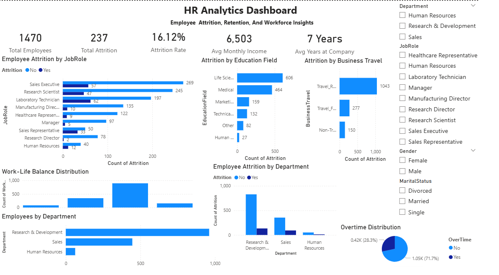

# 📊 HR Analytics Dashboard

An end-to-end **HR Data Analytics project** that analyzes employee attrition and workforce trends using **Python, SQL, and Power BI**.

The project demonstrates the complete analytics workflow — from raw data understanding and cleaning to exploratory data analysis, SQL business analysis, interactive Power BI dashboard development, and business recommendations.

---


---

## 📌 Project Overview

Employee attrition is an important challenge for organizations because high employee turnover can increase recruitment costs, reduce productivity, and affect workforce stability.

This project analyzes the **IBM HR Employee Attrition dataset** to identify patterns and factors associated with employee turnover.

The analysis combines **Python, SQL, and Power BI** to transform raw employee data into meaningful business insights.

### 🎯 Project Goal

The primary goal is to:

* Understand employee attrition patterns
* Identify departments and job roles with higher turnover
* Analyze the relationship between overtime and attrition
* Examine compensation and employee retention
* Explore business travel and work-life balance
* Develop an interactive HR analytics dashboard
* Provide actionable recommendations for improving employee retention

## 🔎 Business Problem

Employee attrition can create significant challenges for organizations, including increased recruitment costs, loss of experienced employees, reduced productivity, and workforce instability.

The HR department needs to understand **why employees leave** and identify the factors associated with higher employee turnover.

This project analyzes employee data to identify patterns in attrition and provide insights that can support better **employee retention and workforce planning decisions**.

---

## ❓ Business Questions

The analysis aims to answer the following business questions:

1. What is the overall employee attrition rate?
2. Which departments have the highest employee attrition?
3. Which job roles experience the highest turnover?
4. Does overtime influence employee attrition?
5. Does compensation appear to affect employee retention?
6. Which age groups experience higher attrition?
7. Does business travel influence employee turnover?
8. Which education fields have higher attrition?
9. Does marital status show differences in employee attrition?
10. How does work-life balance relate to employee retention?
11. Which job roles have the longest employee tenure?
12. What strategies can organizations use to improve employee retention?

## 🛠️ Tools & Technologies

| Tool                 | Purpose                                               |
| -------------------- | ----------------------------------------------------- |
| **Python**           | Data loading, cleaning, and exploratory data analysis |
| **Pandas**           | Data manipulation and analysis                        |
| **Matplotlib**       | Data visualization                                    |
| **SQL**              | Business analysis and querying                        |
| **SQLite**           | Running SQL analysis on the cleaned dataset           |
| **Power BI**         | Interactive dashboard and data visualization          |
| **Jupyter Notebook** | Analysis documentation and workflow                   |
| **Git & GitHub**     | Version control and project management                |

---

## 📊 Dataset

### IBM HR Employee Attrition Dataset

The project uses the **IBM HR Employee Attrition dataset**, which contains employee demographic, job-related, compensation, satisfaction, and attrition information.

The dataset includes variables related to:

* Employee demographics
* Department and job role
* Education
* Monthly income
* Job satisfaction
* Work-life balance
* Overtime
* Business travel
* Years at company
* Employee attrition

### Dataset Preparation

The raw dataset was processed through the following steps:

1. Loaded and inspected the raw dataset.
2. Checked for duplicate records.
3. Checked for missing values.
4. Verified data types.
5. Removed unnecessary columns containing constant values or employee identifiers.
6. Saved the cleaned dataset for further analysis.

The cleaned dataset was then used for **Python EDA, SQL analysis, and Power BI dashboard development**.

## 🔄 Project Workflow

The project follows a structured end-to-end data analytics workflow:

```text
Raw HR Dataset
      ↓
Data Understanding
      ↓
Data Cleaning
      ↓
Exploratory Data Analysis
      ↓
SQL Business Analysis
      ↓
Power BI Dashboard
      ↓
Business Insights
      ↓
Recommendations
```

### 1️⃣ Data Understanding

**Notebook 01 – Data Understanding**

* Loaded the raw HR dataset.
* Examined the dataset structure and dimensions.
* Reviewed available columns and data types.
* Checked for missing values.
* Examined numerical and categorical variables.
* Identified potential variables related to employee attrition.

### 2️⃣ Data Cleaning

**Notebook 02 – Data Cleaning**

* Created a copy of the raw dataset.
* Checked for duplicate records.
* Checked for missing values.
* Verified data types.
* Identified unnecessary columns.
* Removed constant-value and identifier columns.
* Saved the cleaned dataset.

### 3️⃣ Exploratory Data Analysis

**Notebook 03 – Exploratory Data Analysis**

* Analyzed employee attrition distribution.
* Examined department and job-role distribution.
* Analyzed monthly income.
* Explored overtime patterns.
* Examined work-life balance.
* Identified potential factors associated with employee turnover.

### 4️⃣ SQL Business Analysis

**Notebook 04 – SQL Analysis**

SQL was used to answer business questions related to:

* Employee attrition
* Department turnover
* Job-role attrition
* Overtime
* Age
* Compensation
* Education
* Marital status
* Business travel
* Employee tenure

### 5️⃣ Power BI Dashboard

**Notebook 05 – Power BI Dashboard**

An interactive dashboard was developed to provide a visual overview of employee attrition and workforce trends.

The dashboard includes:

* KPI cards
* Department analysis
* Job-role attrition
* Overtime analysis
* Education analysis
* Business travel analysis
* Work-life balance
* Interactive filters

### 6️⃣ Business Insights & Recommendations

**Notebook 06 – Business Insights and Recommendations**

The final analysis summarizes the major findings and provides recommendations focused on:

* Reducing excessive overtime
* Improving employee retention
* Reviewing compensation policies
* Improving work-life balance
* Reviewing business travel policies

## 📁 Repository Structure

```text
HR-Analytics-Dashboard/
│
├── data/
│   ├── raw/
│   │   └── hr_employee_attrition.csv
│   │
│   └── cleaned/
│       └── hr_employee_attrition_cleaned.csv
│
├── docs/
│   ├── Business_Problem.md
│   └── Business_Questions.md
│
├── Images/
│   └── PowerBI_dashboard.png
│
├── notebooks/
│   ├── 01_Data_Understanding.ipynb
│   ├── 02_Data_Cleaning.ipynb
│   ├── 03_Exploratory_Data_Analysis.ipynb
│   ├── 04_SQL_Analysis.ipynb
│   ├── 05_PowerBI_Dashboard.ipynb
│   └── 06_Business_Insights.ipynb
│
├── sql/
│   ├── hr_analysis.sql
│   └── interview_questions.sql
│
├── .gitignore
├── LICENSE
├── README.md
└── requirements.txt
```

### 📂 Folder Description

| Folder / File      | Description                                   |
| ------------------ | --------------------------------------------- |
| `data/raw/`        | Original HR employee attrition dataset        |
| `data/cleaned/`    | Cleaned dataset used for analysis             |
| `docs/`            | Business problem and business questions       |
| `images/`          | Power BI dashboard screenshot                 |
| `notebooks/`       | Complete Python and SQL analysis workflow     |
| `sql/`             | SQL business analysis and interview questions |
| `.gitignore`       | Files excluded from version control           |
| `LICENSE`          | Project license                               |
| `README.md`        | Project documentation                         |
| `requirements.txt` | Python dependencies                           |

## 📊 Key Business Findings

The analysis identified several important patterns related to employee attrition and workforce retention.

### 👥 Workforce Overview

* Total employees: **1,470**
* Employees who left: **237**
* Overall attrition rate: **16.12%**

### 🏢 Department Analysis

* **Research and Development** has the largest workforce.
* **Sales** is the second-largest department.
* **Human Resources** has the smallest workforce.
* Attrition varies across departments, indicating different retention challenges.

### 💼 Job Role Analysis

* **Sales Executives** experience high employee turnover.
* **Research Scientists** also show significant attrition.
* **Laboratory Technicians** represent another important high-turnover job role.

### ⏰ Overtime

* Employees working overtime represent a significant portion of employees who leave.
* Overtime appears to be an important factor associated with employee attrition.

### 💰 Compensation

- Monthly income varies considerably across employees.

- Employees who leave show different average monthly income compared with employees who stay, suggesting compensation may be associated with employee retention.

### ✈️ Business Travel

- Attrition varies across business travel categories, with frequent travelers representing an important group for further retention analysis.

- Business travel patterns may be associated with employee turnover and should be monitored as part of retention analysis.

### ⚖️ Work-Life Balance

* Most employees report a work-life balance rating of **3**.
* Although the overall rating is moderate, improving work-life balance may support better employee retention.

### 🎓 Employee Demographics

* Attrition patterns vary across education fields, marital status, and age groups.
* These demographic patterns can help HR teams identify employee groups that may require additional retention attention.

## 📊 Power BI Dashboard

The interactive Power BI dashboard provides a consolidated view of employee attrition, workforce demographics, and potential retention factors.

### Dashboard Highlights

* **Total Employees**
* **Total Attrition**
* **Attrition Rate**
* **Average Monthly Income**
* **Average Years at Company**
* Employee distribution by department
* Attrition by department
* Attrition by job role
* Overtime analysis
* Attrition by education field
* Attrition by business travel
* Work-life balance analysis

### Interactive Filters

Users can explore the dashboard dynamically using slicers for:

* Department
* Gender
* Marital Status
* Job Role

### Dashboard Preview



## 💡 Business Recommendations

Based on the analysis, the following strategies could help improve employee retention and reduce unnecessary turnover.

### ⏰ Reduce Excessive Overtime

* Monitor employee workloads and overtime hours.
* Improve workforce planning to distribute workloads effectively.
* Introduce flexible working arrangements where appropriate.
* Identify teams with consistently high overtime levels.

### 👥 Strengthen Retention Programs

* Develop targeted retention strategies for high-risk job roles.
* Conduct regular employee engagement and satisfaction surveys.
* Provide career development and internal mobility opportunities.
* Monitor attrition trends by department and job role.

### 💰 Review Compensation

* Evaluate compensation across departments and job roles.
* Benchmark salaries against relevant industry standards.
* Identify roles where compensation may be contributing to employee turnover.
* Consider performance-based incentives where appropriate.

### ⚖️ Improve Work-Life Balance

* Encourage employees to use available vacation time.
* Promote flexible working arrangements where possible.
* Monitor workload and employee satisfaction.
* Introduce employee wellness initiatives.

### ✈️ Review Business Travel

* Reduce unnecessary business travel where virtual alternatives are practical.
* Provide additional support for employees with frequent travel requirements.
* Monitor attrition among frequently traveling employees.
* Consider hybrid alternatives for suitable business activities.

## 🏁 Conclusion

This project demonstrates an end-to-end HR analytics workflow using **Python, SQL, and Power BI**.

The analysis transformed the IBM HR Employee Attrition dataset into actionable insights by:

* Understanding and cleaning employee data
* Exploring workforce and attrition patterns
* Answering business questions using SQL
* Building an interactive Power BI dashboard
* Identifying potential factors associated with employee turnover
* Developing data-driven recommendations for employee retention

The findings highlight the importance of monitoring **overtime, compensation, business travel, job roles, and work-life balance** when developing employee retention strategies.

---

## 🚀 Future Improvements

The project can be extended with more advanced analytics, including:

* **Machine Learning** for employee attrition prediction
* **Employee risk scoring** to identify employees with a higher likelihood of leaving
* **Employee segmentation** using clustering techniques
* **Statistical hypothesis testing** to validate relationships between variables
* **Advanced Power BI analytics** with additional KPIs and drill-through pages
* **Automated reporting** for ongoing HR monitoring

---

## 🧰 How to Run the Project

### 1. Clone the Repository

```bash
git clone https://github.com/supriyaklara2698-boop/HR-Analytics-Dashboard.git
```

### 2. Navigate to the Project

```bash
cd HR-Analytics-Dashboard
```

### 3. Create a Virtual Environment

```bash
python -m venv venv
```

### 4. Activate the Virtual Environment

**Windows PowerShell:**

```powershell
.\venv\Scripts\Activate.ps1
```

### 5. Install Dependencies

```bash
pip install -r requirements.txt
```

### 6. Run the Notebooks

Open the `notebooks/` folder using Jupyter Notebook or VS Code and run the notebooks in order:

```text
01_Data_Understanding.ipynb
02_Data_Cleaning.ipynb
03_Exploratory_Data_Analysis.ipynb
04_SQL_Analysis.ipynb
05_PowerBI_Dashboard.ipynb
06_Business_Insights.ipynb
```

### 7. Power BI Dashboard

The Power BI dashboard was developed using the cleaned HR dataset.

The final dashboard screenshot is available in:

`Images/PowerBI_dashboard.png`

The dashboard development process and measures are documented in:

`notebooks/05_PowerBI_Dashboard.ipynb`

---

## 👩‍💻 Author

**Supriya Klara**

Data Analytics | Python | SQL | Power BI

- GitHub: [supriyaklara](https://github.com/supriyaklara2698-boop)
- LinkedIn: [Supriya Klara](www.linkedin.com/in/supriya-klara-19aa5040b)
---

⭐ If you found this project useful, consider giving it a star on GitHub.